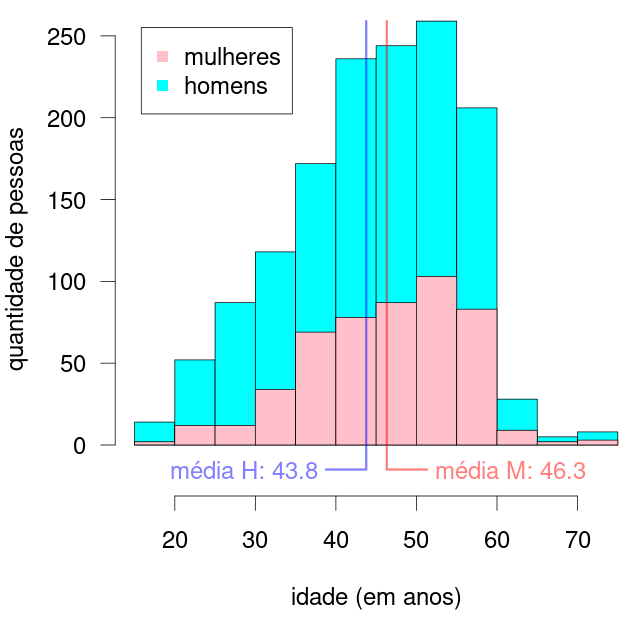

# Análise demográfica das pessoas presas após os ataques na praça dos Três Poderes em Brasília no dia 8 de janeiro de 2023

## Introdução

Este repositório contém os dados publicados pela Secretaria de Estado de Administração Penitenciária do Distrito Federal (SEAPE-DF), assim que o programa em R para análise demográfica dos mesmos.

A lista de pessoas presas nos atos terroristas na Praça dos Três Poderes é atualizada frequentemente 
na [ṕagina da SEAPE-DF](https://seape.df.gov.br/prisoes-dos-atentados-bsb/), contendo os nomes completos, as datas de nascimento e o estado de origem das pessoas.

## Análise

### Gênero

A [lista atual](presos.csv), contém 1429 nomes. Esta lista não corresponde à ultima listagem disponibilizada pela SEAPE, que contém 1388 nomes, na listagem publicada em 22 de janeiro de 2023. Todos os nomes que figuravam nas listas previamente publicadas foram mantidos. Destas 1429 pessoas, 494 são mulheres e 935 são homens.

### Idades

A distribuição de idades é mostrada no gráfico abaixo, com as pessoas agrupadas em faixas etárias de 5 anos. Mulheres são representadas na cor rosa e homens na cor azul. Todas as idades relatadas nesta análise são relativas ao dia 8 de janeiro de 2023.

A idade mínima é de 18,0 anos e a máxima de 74,8 anos. 66,3% das pessoas têm entre 40 e 60 anos e 35,2% deles têm entre 45 e 55 anos. Está claro que o grosso do contingente é formado por pessoas de meia idade.

A mediana de idade das mulheres é de 47,9 anos e a dos homens de 44,8 anos. A média de idade das mulheres é de 46,4 anos e a dos homens é de 43,8 anos. Esta diferença de idade de 2,6 anos entre homens e mulheres é estatisticamente significativa (_t_[1122.6] = 4.72, _p_ < 0.001).

Cabe observar que a faixa de idade com maior representatividade entre as mulheres é entre 50 e 55 anos.

## Procedência

O número de pessoas por estado está indicado na tabela abaixo (a informação do estado de origem está ausente para 43 pessoas):

|estado|número|porcentagem|
|-|-|-|
|SP|272|19.6%|
|MG|200|14.4%|
|PR|132|9.5%|
|MT|103|7.4%|
|RS|103|7.4%|
|SC|88|6.3%|
|DF|82|5.9%|
|BA|69|5.0%|
|GO|49|3.5%|
|RO|41|3.0%|
|PA|40|2.9%|
|RJ|33|2.4%|
|MS|32|2.3%|
|CE|25|1.8%|
|TO|20|1.4%|
|ES|18|1.3%|
|PB|15|1.1%|
|AL|13|0.9%|
|MA|11|0.8%|
|PE|11|0.8%|
|RN|9|0.6%|
|PI|8|0.6%|
|AM|6|0.4%|
|AC|3|0.2%|
|AP|1|0.1%|
|RR|1|0.1%|
|SE|1|0.1%|

O número de presos por estado está relacionada à [porcentagem de votos em
Jair Bolsonaro no segundo turno da eleição presidencial de
2022](eleicao-2022.csv), como indica o gráfico abaixo.

Neste gráfico, cada estado está representado pela sua sigla. Foram incluídos na análise os estados que apresentam número de presos maior do que 3, para efeitos de confiabilidade da análise. Note que o eixo vertical do gráfico (número de presos) está em escala logarítmica, o que é adequado para variáveis de contagem. A correlação entre as duas variáveis é significativamente diferente de zero (_r_ = 0.57,_t_[21] = 3.21, _p_ < 0.01). A linha de regressão entre as duas variáveis está indicada em vermelho no gráfico.

## Author

Copyright © 2023  Rafael Laboissière (<rafael@laboissiere.net>)

O material contido neste repositório pode ser livremente distribuído e reproduzido de acordo com os termos da licença [Creative Commons Attribution 4.0 International (CC BY 4.0)](https://creativecommons.org/licenses/by/4.0/).

<!---
Local Variables:
ispell-local-dictionary: "brasileiro"
eval: (auto-fill-mode -1)
eval: (visual-line-mode)
eval: (flyspell-mode)
End:
--->
